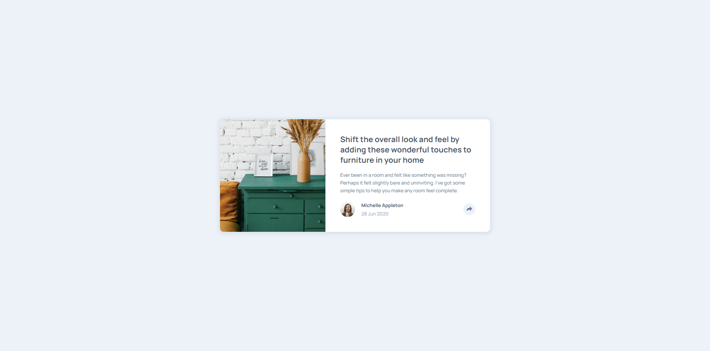

# Frontend Mentor - Article preview component solution

This is a solution to the [Article preview component challenge on Frontend Mentor](https://www.frontendmentor.io/challenges/article-preview-component-dYBN_pYFT). Frontend Mentor challenges help you improve your coding skills by building realistic projects.

## Table of contents

- [Overview](#overview)
  - [Screenshot](#screenshot)
  - [Links](#links)
- [My process](#my-process)
  - [Built with](#built-with)
- [Author](#author)

## Overview

### Screenshot

### Links

- Solution URL: [solution](https://www.frontendmentor.io/challenges/article-preview-component-dYBN_pYFT/hub)
- Live Site URL: [live](https://lackevil.github.io/Article-preview-component/)

### Built with

- Semantic, Validate HTML5 markup
- CSS
- FlexBox
- JS
- TippyJS
